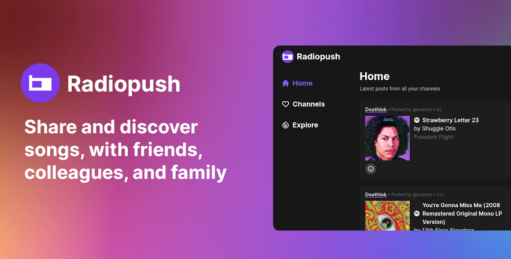

# Radiopush

Radiopush is a new way of music discovery. It helps you find new songs by sharing with your friends, colleagues and family. Whether it's a jam you are just vibing to or an obscure track from your favorite artist, share it with the community of Radiopush and help others

## Principles:
1. Focus on Music
2. Minimal
3. Open

## Contributing

TL;DR

1. Fork it!
2. Create your feature branch: git checkout -b my-new-feature
3. Commit your changes: git commit -am 'Add some feature'
4. Push to the branch: git push origin my-new-feature
5. Submit a pull request :D

