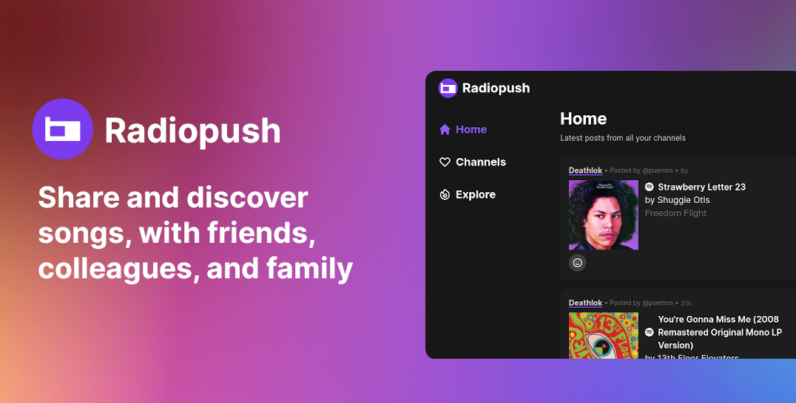

# Radiopush

Share and discover songs, with friends colleagues and family  
Create private or public channels, share them with anyone

[https://radiopush.app](https://radiopush.app)

## Principles:
1. Focus on Music
2. Minimal
3. Open

## Contributing

TL;DR

1. Fork it!
2. Create your feature branch: git checkout -b my-new-feature
3. Commit your changes: git commit -am 'Add some feature'
4. Push to the branch: git push origin my-new-feature
5. Submit a pull request :D

